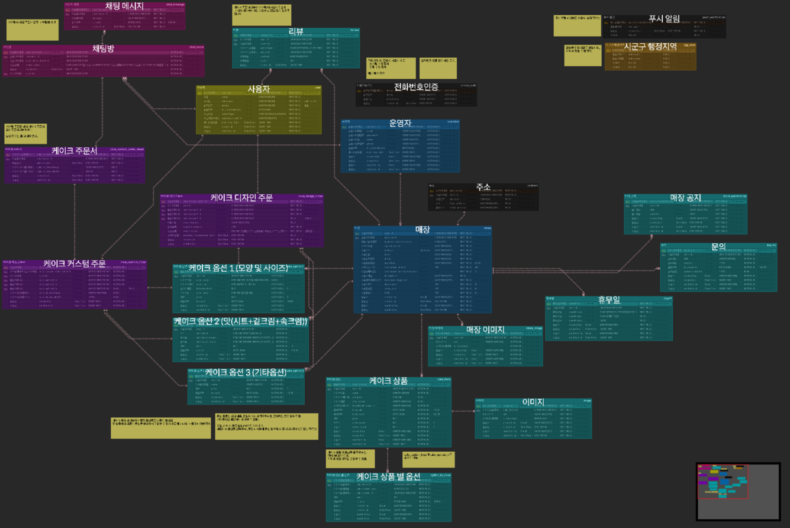

# Custom Cake (CC)
#### 레터링 케이크 디자인, 주문 플랫폼

### 1. [ERD](https://www.erdcloud.com/d/pGZqMrnzEYmW5H7uk)


### 2. Package 구조
- Hexagonal Architecture

  [1. 스프링 코드로 이해하는 핵사고날 아키텍처](https://nahwasa.com/entry/%ED%97%A5%EC%82%AC%EA%B3%A0%EB%82%A0-%EC%8A%A4%ED%94%84%EB%A7%81%EB%B6%80%ED%8A%B8-%ED%97%A5%EC%82%AC%EA%B3%A0%EB%82%A0-%EC%95%84%ED%82%A4%ED%85%8D%EC%B3%90-%EC%BD%94%EB%93%9C-%EA%B5%AC%EC%A1%B0)

  [2. 클린 아키텍처 with Spring Boot](https://wlswoo.tistory.com/67)

```
├── kotlin
│   └── com
│       └── cake
│           └── customcakebackend
│               ├── adapter/
│               │   ├── in/
│               │   │   └── web/
│               │   │       ├── Controller.kt
│               │   │       └── dto/
│               │   │           ├── request/
│               │   │           └── response/
│               │   └── out/
│               │       └── persistence/
│               │           ├── PersistenceAdapter.kt
│               │           ├── mapper/
│               │           ├── repository/
│               │           └── entity/
│               │               └── UserEntity.kt
│               ├── application/
│               │   └── port/
│               │       ├── in/      # UseCase
│               │       └── out/     # Port
│               ├── configuration/
│               │   └── QuerydslConfiguration.kt
│               └── domain/
│                   └── User.kt
└── resources/
   ├── static/
   ├── templates/
   └── application.yml
```
