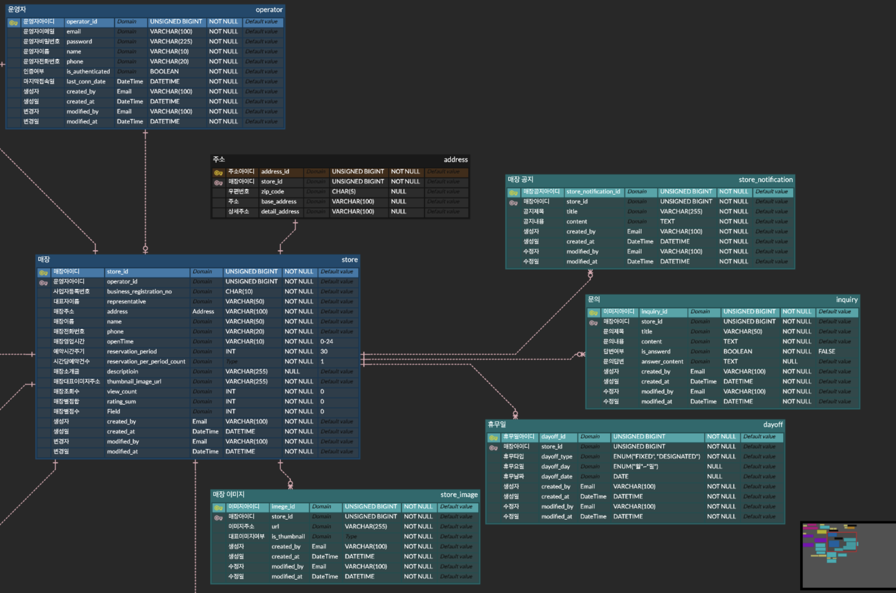
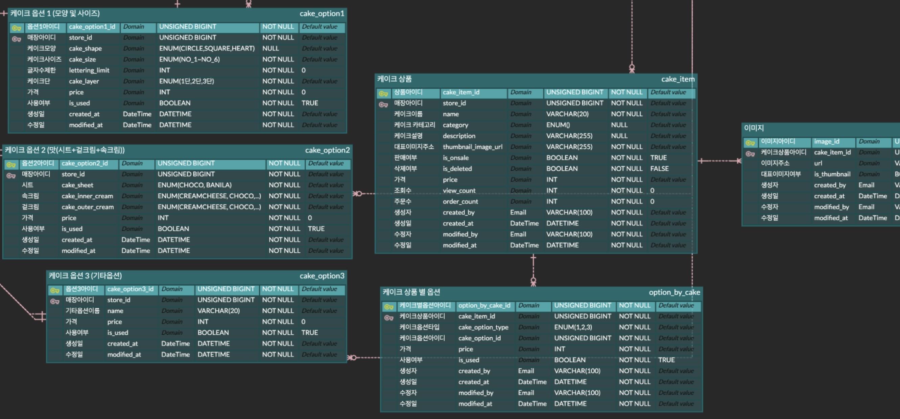
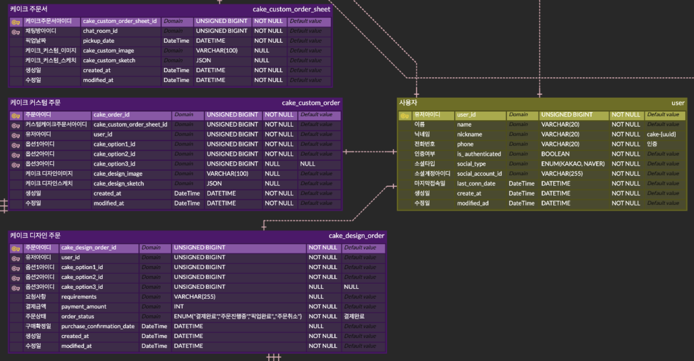
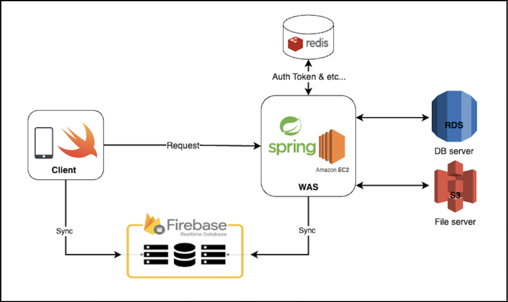
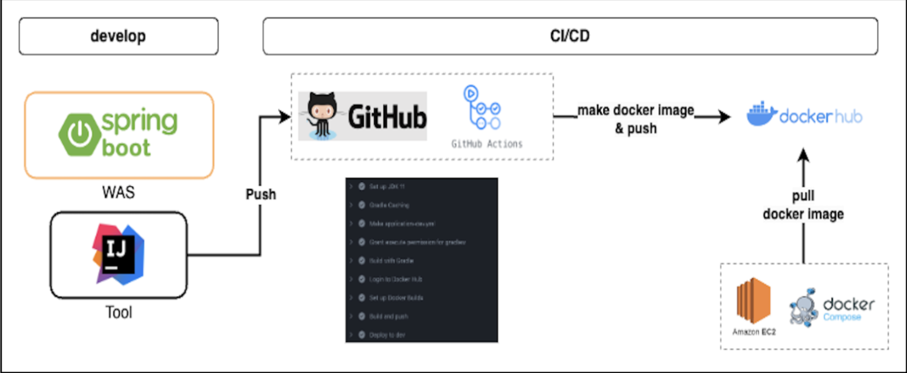

# Custom Cake (CC)
#### : 온라인 주문/결제 서비스를 활용한 레터링 케이크 검색, 주문, 예약 및 통합 관리 플랫폼

### * 추진 목표 🔖
#### : Custom Cake를 통한 효율적인 주문/예약 절차와 문화 형성

### * 참여 멤버 🙆‍♀️
<table>
    <tr>
        <td align="center"><a href="https://github.com/kimyoungi99"><br /><sub><b>kimyoungi99</b></sub></a><br /><span>백엔드</span></td>
        <td align="center"><a href="https://github.com/jjaen0823"><br /><sub><b>jjaen0823</b></sub></a><br /><span>백엔드, 프론트엔드</span></td>
        <td align="center"><a href="https://github.com/swiftie1230"><br /><sub><b>swiftie1230</b></sub></a><br /><span>프론트엔드</span></td>
    </tr>
</table>

### 1. [ERD](https://www.erdcloud.com/d/pGZqMrnzEYmW5H7uk)
#### 1.1 운영자, 케이크 매장 관련 Entity


#### 1.2 케이크 상품, 옵션 관련 Entity


#### 1.3 사용자, 케이크 기본 주문, 커스텀 주문 관련 Entity



### 2. Swagger API
- [Dev Swagger API URL](http://43.201.13.139:8080/swagger-ui/index.html)

### 3. Package 구조

#### 3.1. frontend 구조
```
└── custom-cake-frontend
    ├── API/
    ├── Assets.xcassets/
    ├── Chat/
    ├── Data/
    ├── Login/
    ├── Main/
    │   ├── Map/
    │   └── Stores/
    ├── Orders/
    │   ├── BasicOrder/
    │   └── CustomOrder/
    ├── Profile/
    ├── Search/
    └── Store/
```
[//]: # (  [1. 스프링 코드로 이해하는 핵사고날 아키텍처]&#40;https://nahwasa.com/entry/%ED%97%A5%EC%82%AC%EA%B3%A0%EB%82%A0-%EC%8A%A4%ED%94%84%EB%A7%81%EB%B6%80%ED%8A%B8-%ED%97%A5%EC%82%AC%EA%B3%A0%EB%82%A0-%EC%95%84%ED%82%A4%ED%85%8D%EC%B3%90-%EC%BD%94%EB%93%9C-%EA%B5%AC%EC%A1%B0&#41;)
[//]: # ()
[//]: # (  [2. 클린 아키텍처 with Spring Boot]&#40;https://wlswoo.tistory.com/67&#41;)
#### 3.2. backend 구조 
- Hexagonal Architecture
```
├── kotlin
│   └── com
│       └── cake
│           └── customcakebackend
│               ├── adapter/
│               │   ├── in/
│               │   │   └── web/
│               │   │       ├── RestController.kt
│               │   │       ├── mvc/
│               │   │       │   └── Controller.kt
│               │   │       └── dto/
│               │   │           ├── request/
│               │   │           └── response/
│               │   └── out/
│               │       └── persistence/
│               │           ├── PersistenceAdapter.kt
│               │           ├── mapper/
│               │           ├── repository/
│               │           └── entity/
│               │               └── UserEntity.kt
│               ├── application/
│               │   └── port/
│               │       ├── in/      # UseCase
│               │       └── out/     # Port
│               │   └── service/     # Service
│               ├── common/
│               │   ├── EnumClass.kt
│               │   └── converter/
│               ├── configuration/
│               │   └── QuerydslConfiguration.kt
│               ├── domain/
│               │   └── User.kt
│               └── exception/
└── resources/
   ├── static/
   ├── templates/
   └── application.yml
```

### 4. Service Architecture


| 기술 스택       | 개발 환경                                                                                                 |  
|-------------|-------------------------------------------------------------------------------------------------------| 
| Spring Boot | - Spring Framwork 2.7.9 </br> - Kotlin 1.6.21 </br> - Gradle </br> - Spring Web Mvc (Thymeleaf) </br> |
| ORM         | - JPA </br> - QueryDsl 5.0.0                                                                          |
| Database    | - MySQL (AWS RDS) </br> - Firebase Realtime Database (Chatting Server) </br> - S3 (File Server)       | 
| Swift       | - SwiftUI </br> -  XCode                                                                              |  




### 5. CICD pipeline

